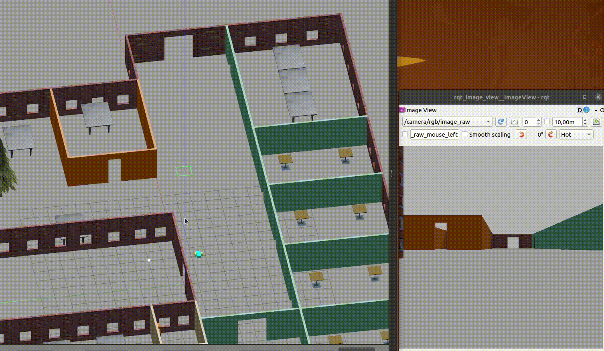

# Project 2: Go Chase It!

## Sample GIF

## Checklist

* [x] Basic Requirements
    - [x] [Submission Folder](catkin_ws/src/) with the required structure of the files.

* [x] Robot Design
    - [x] Lidar and camera sensors.
    - [x] Gazebo plugins for the robot’s differential drive, lidar, and camera.
    - [x] Housed inside the world
    - [x] Robot design change:
        * [x] Color
        * [x] Wheel radius
        * [x] Chassis dimensions

* [x] Gazebo world
    - [x] A new world that you design on the building editor for this project.
    - [x] Includes a white-colored ball

* [x] Ball Chasing
    - [x] `drive_bot`:
        * [x] A ball_chaser/command_robot service.
        * [x] Service accepts linear x and angular z velocities.
        * [x] Service publishes to the the wheel joints.
        * [x] Service returns the requested velocities.
    - [x] `process_image`:
        * [x] Subscribes to the robot’s camera image.
        * [x] A function to analyze the image and determine the presence and position of a white ball.
        * [x] Requests a service to drive the robot towards a white ball (when present).
