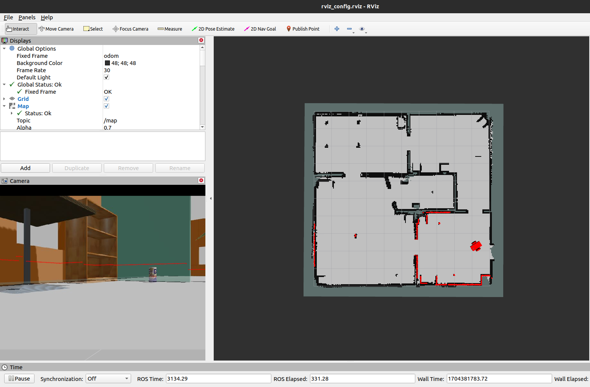
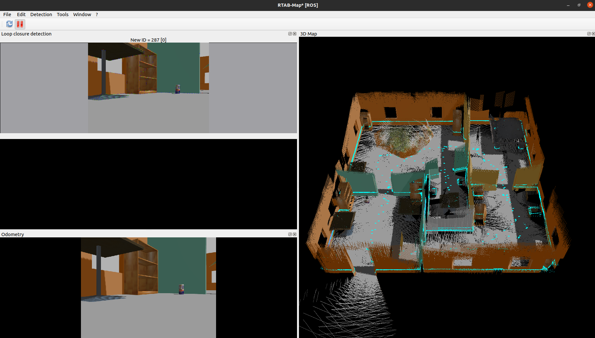
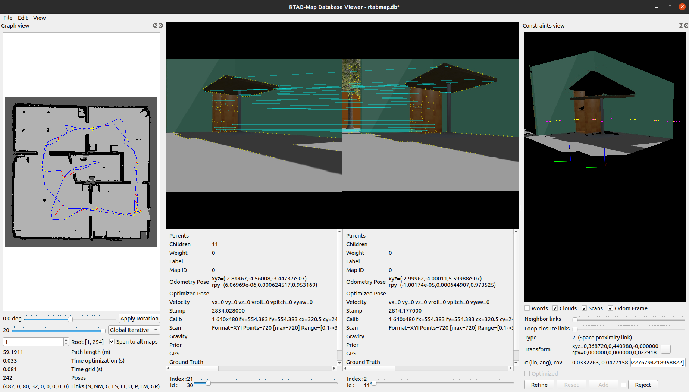

# Project 4: Map my world

## Illustrations
 
 
 

## How to run

1. Clone the repo `git clone https://github.com/mishakin/robotics_sw_engineer.git`
2. `cd robotics_sw_engineer/Project4_Map_my_world/catkin_ws/src`
3. `catkin_init_workspace`
4. `cd ..`
5. `catkin_make`
6. `source devel/setup.bash`
7. `roslaunch my_robot main.launch distro:=kinetic` or `roslaunch my_robot main.launch distro:=noetic` (default) depending on your ROS distro 

## Checklist

* [x] Basic Requirements
    - [x] Student submited all required files: ROS Package: robot and [RTABMAP Db file generated](rtabmap_db.zip) (a zip-archive of the `rtabmap.db`)

* [x] Simulation Setup
    - [x] Student's simulation world and robot could properly load in Gazebo.
    - [x] The student's environment should have clear features and geometric shapes to perform mapping.

* [x] Mapping Package
    - [x] Student created the following launch files properly: `mapping.launch` `teleop.launch` `localization.launch`. The student's program should be able to launch without errors 

* [x] Mapping Accuracy
    - [x] Student's map should contain at least 3 loop closures and the occupancy grid is identifiable
    - [x] Student's map should clearly portray the environment. The student should be able to display the characteristics of the landmark features.

