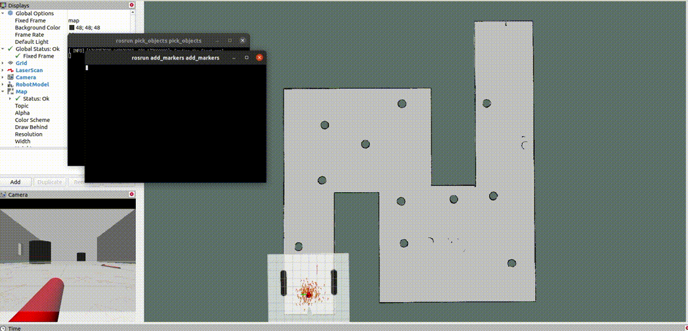

# Project 5: Home Service Robot

## Illustrations

 

## How to run 

### Common part
1. Clone the repo `git clone https://github.com/mishakin/robotics_sw_engineer.git`
2. `cd robotics_sw_engineer/Project5_Home_service_robot/catkin_ws/src`
3. `catkin_init_workspace`
4. `cd ..`
5. `catkin_make`
6. `source devel/setup.bash`

### SLAM (map creation)
* `chmod u+x src/scripts/test_slam.sh`
* `src/scripts/test_slam.sh`

### Manual testing of the navigation in the map

* `chmod u+x src/scripts/test_navigation.sh`
* `src/scripts/test_navigation.sh`

### Home service robot
* `chmod u+x src/scripts/home_service.sh`
* `src/scripts/home_service.sh`

## Brief Write-up

The following packages were used / created in the project:

* `my_robot`: package from the previous projects containing a wheeled robot
* `slam_gmapping`: for creating of the map of the environment
* `teleop_twist_keyboard`: for navigating the robot via keyboard during SLAM phase
* `amcl` for localization in the map, created by the slam package
* `add_markers`: a node adding virtual cube markers in rviz
* `pick_objects`: node, sending navigation commands to the robot

## Checklist

* [x] Basic Requirements
    - [x] Student submitted all required files: ROS Packages Shell scripts

* [x] Simulation Setup
    - [x] Student's simulation world and robot could properly load in Gazebo.

* [x] Mapping
    - [x] The student should write a `test_slam.sh` script file and launch it to manually test SLAM.
    - [x] Student created a functional map of the environment which would be used for localization and navigation tasks.

* [x] Localization and Navigation
    - [x] The student's robot could navigate in the environment after a 2D Nav Goal command is issued. The student created a `test_navigation.sh` script file to launch it for manual navigation test.
    - [x] "The student created a `pick_objects.sh` file that will send multiple goals for the robot to reach. The robot travels to the desired pickup zone, displays a message that it reached its destination, waits 5 seconds, travels to the desired drop off zone, and displays a message that it reached the drop off zone."

* [x] Home Service Functions
    - [x] The student should write an `add_marker.sh` file that will publish a marker to rviz. The marker should initially be published at the pickup zone. After 5 seconds it should be hidden. Then after another 5 seconds it should appear at the drop off zone.
    - [x] The student should write a `home_service.sh` file that will run all the nodes in this project. The student's home service robot should be simulated as follow: Initially show the marker at the pickup zone. Hide the marker once your robot reach the pickup zone. Wait 5 seconds to simulate a pickup. Show the marker at the drop off zone once your robot reaches it.
    - [x] The student should include a brief write-up explaining the packages used for this project, covering localization, mapping and navigation.

